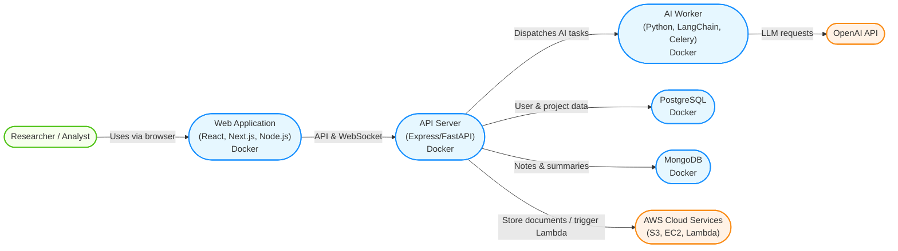

# Architecture Overview
## Introduction
The AI-Powered Collaborative Research Assistant is a web application designed to enable researchers and teams to collaboratively gather, synthesize, and visualize information from diverse sources in real-time. The system leverages AI technologies to automate summarization and entity extraction, supporting efficient and interactive research workflows.

## System-Context
The system interacts with several external actors and services:
- **Users**: Researchers, analysts, and content creators accessing the frontend via web browsers.
- **Third-Party APIs**: OpenAI API for language model services.
- **Cloud Services**: AWS components for hosting, storage, and serverless AI tasks.

## Key Requirements and Quality Goals
- **Real-time Collaboration**: Support multiple users editing and annotating documents simultaneously.
- **Scalability**: Handle growing data volumes and user concurrency.
- **Extensibility**: Modular design to integrate new AI models and data sources.
- **Security**: Authentication, authorization, and data protection.
- **Reliability**: Robust asynchronous processing and fault tolerance.

## High-Level Architecture
The system consists of the following main components:
| Component | Description |
|-----------|-------------|
| Frontend  | React with Next.js (SSR/SSG), TypeScript, Tailwind CSS, D3.js for interactive visualizations |
| Backend   | Node.js (Express.js) or Python (FastAPI/Django), WebSockets (Socket.IO) for real-time features, OpenAI API integration, LangChain for LLM workflows, Celery/RabbitMQ for async tasks |
| Database  | PostgreSQL for structured data (users, projects), MongoDB for flexible data (notes, summaries) |
| Cloud     | AWS EC2 for backend hosting, S3 for document storage, Lambda for serverless AI tasks, DynamoDB optional for real-time data |
| DevOps    | Docker for containerization, GitHub Actions for CI/CD pipelines |

## Component Details
### Frontend
- **Responsibilities**: User interface, real-time collaboration UI, data visualization.
- **Technologies**: React, Next.js, TypeScript, Tailwind CSS, D3.js.
- **Interfaces**: Communicates with backend REST API and WebSocket server.

### Backend
- **Responsibilities**: API endpoints, WebSocket server for real-time collaboration, AI task orchestration.
- **Technologies**: Node.js with Express.js or Python with FastAPI/Django, Socket.IO, Celery/RabbitMQ.
- **Interfaces**: Connects to databases, OpenAI API, and cloud services.

### Database
- **PostgreSQL**: Stores user accounts, project metadata, access control.
- **MongoDB**: Stores research notes, AI-generated summaries, and annotations.

### Cloud Infrastructure
- **AWS EC2**: Hosts backend services.
- **AWS S3**: Stores uploaded documents.
- **AWS Lambda**: Runs serverless AI processing tasks.
- **DynamoDB** (optional): Manages real-time data storage if preferred over MongoDB.

## Data Flow
1. User uploads a document or submits a URL via the frontend.
2. Backend receives the input and triggers asynchronous AI processing tasks.
3. AI services (OpenAI API, LangChain) analyze and summarize content.
4. Results are stored in MongoDB and PostgreSQL.
5. Frontend retrieves processed data and renders interactive visualizations.
6. Users collaborate in real-time via WebSocket connections, editing and annotating documents.

## Deployment & Infrastructure
- The application is containerized using Docker.
- Continuous Integration and Deployment pipelines are implemented with GitHub Actions.
- The backend and frontend run on AWS EC2 instances.
- Static assets and documents are stored in AWS S3.
- Serverless AI functions are deployed on AWS Lambda.
- Monitoring and logging are configured to ensure system health and performance.

## Security Considerations
- Authentication and authorization are implemented using JWT or OAuth2.
- Data transmissions are encrypted via HTTPS and secure WebSocket connections.
- Sensitive data is encrypted at rest.
- Access control restricts project and document visibility to authorized users.

## Architectural Decisions
- **Use of WebSockets**: Enables low-latency, real-time collaboration similar to Google Docs.
- **Hybrid Database Approach**: PostgreSQL for relational data integrity, MongoDB for flexible document storage.
- **AI Integration**: OpenAI API chosen for state-of-the-art LLM capabilities; LangChain facilitates complex workflows.
- **Containerization**: Docker ensures consistent environments across development and production.
- **Cloud Provider**: AWS selected for its broad service offerings and scalability.

## Further Reading
- See [Api_Reference](/docs/api_reference.md) for detailed API documentation.
- Refer to /docs/developer_guide.md for setup and contribution instructions.
- Consult the Wiki for feature-specific and user-facing documentation.

This architecture document will be updated regularly to reflect changes and improvements in the system design.
